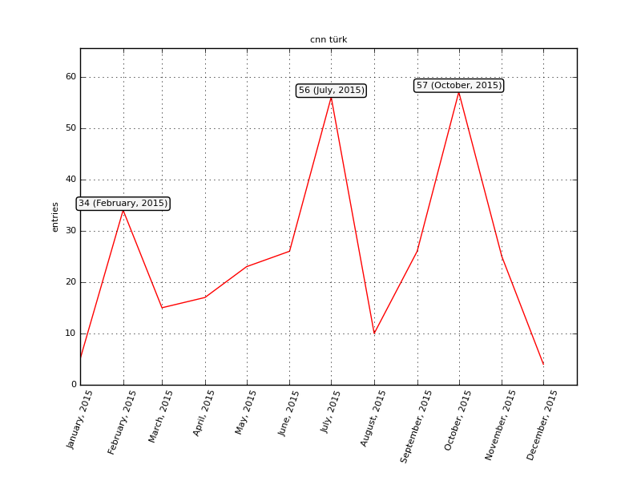

# installation

    pip install git+https://github.com/egemenyildiz/sourgraph.git

    
# usage

    $> sourgraph -h
    
    usage: sourgraph [-h] [-pr PAGE_RANGE] [-sy START_YEAR] [--trim] [--with-news]
                     title
    
    positional arguments:
      title                 ek$i title
    
    optional arguments:
      -h, --help            show this help message and exit
      -pr PAGE_RANGE, --page-range PAGE_RANGE
                            page range like "3-11"
      -sy START_YEAR, --start-year START_YEAR
                            start year (e.g. 2002)
      --trim                Trim lower points in graph
      --with-news           Include news from hurriyet.com

# demo

### asciicast:

### graph:

### news url:

[http://www.hurriyet.com.tr/index/cnn türk?d=20151001](http://www.hurriyet.com.tr/index/cnn%20t%C3%BCrk?d=20151001 "cnn türk")

